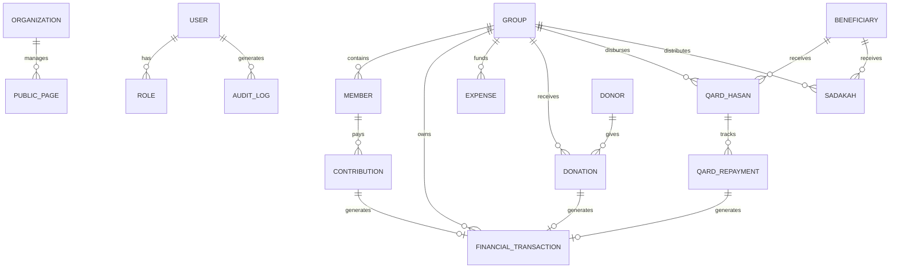

# Foundation Accounting Architecture & Domain Model

## 1. Group-Centric Accounting Model

In the Foundation Management System, a **Group** is an autonomous financial unit representing an accounting fund. The foundational equation governing every group is:

$$\text{Group Balance} = \sum \text{Inflows} - \sum \text{Outflows}$$

Where:
- **Inflows** include:
  - Member Contributions
  - Donor Contributions & Direct Donations
  - Qard Hasan Repayments (Principal returned)
  - Inter-Group Transfers In (`TRANSFER_IN`)
  - Other Capital Grants / Opening Balance
- **Outflows** include:
  - Operating & Capital Expenses (Permanent outflow)
  - Sadakah Disbursements (Permanent benevolent grant with 0 repayment obligation)
  - Qard Hasan Disbursements (Temporary loan receivable; cash leaves, receivable created)
  - Inter-Group Transfers Out (`TRANSFER_OUT`)

---

## 2. Invariant Rules & Data Integrity

1. **Member-to-Group Cardinality**:
   Every active `Member` possesses a non-nullable foreign key `group_id` referencing a valid `Group`. A member cannot be activated without an accounting group.

2. **Contribution Routing**:
   Contributions are locked to the member's assigned `Group`. When a payment is recorded, `AccountingService.create_transaction` updates the balance with row-level locks (`SELECT ... FOR UPDATE`) and logs a `FinancialTransaction` record of type `CONTRIBUTION`.

3. **Interest-Free Qard Hasan Loan Lifecycle**:
   - `interest_rate = 0.00` is strictly enforced at database and service layers.
   - Initial disbursement: Cash outflow from Group, increases `total_disbursed`, sets `outstanding_amount = principal_amount`.
   - Repayments: Cash inflow into original Group, reduces `outstanding_amount`, increases `total_repaid`.
   - When `outstanding_amount == 0.00`, status transitions to `COMPLETED`.

4. **Double-Entry & Immutability**:
   - Records in `financial_transactions` are never deleted via SQL `DELETE`.
   - Corrections trigger a contra-entry of type `REVERSAL` referencing `parent_transaction_id`.
   - Both original and contra entries remain visible in audit and ledger views, preserving the complete historical timeline.

---

## 3. Database Schema Overview

---

## 4. REST API Endpoints

### Authentication & Core
- `POST /api/v1/auth/login` - Obtain JWT bearer token
- `GET /api/v1/auth/me` - Current authenticated user & permissions
- `GET /api/v1/organization` - Foundation profile & settings
- `PUT /api/v1/organization` - Update foundation settings
- `GET /api/v1/public/pages/{slug}` - Public CMS content with fallback templates
- `PUT /api/v1/public/pages/{slug}` - Update public CMS content

### Financial & Accounting
- `GET /api/v1/groups` - List accounting groups with current balances
- `POST /api/v1/groups` - Create new accounting group
- `POST /api/v1/groups/transfer` - Atomic inter-group fund transfer
- `GET /api/v1/ledgers/group/{id}` - Complete chronological group ledger with running balance
- `GET /api/v1/transactions` - General transaction journal
- `POST /api/v1/transactions/{id}/reverse` - Post contra-entry reversal and restore entity state
- `GET /api/v1/reports/financial` - Aggregated period financial statements
- `GET /api/v1/reports/group-balances` - Group-by-group balance summary

### Operations
- `GET /api/v1/members` & `POST /api/v1/members` - Member directory & management
- `POST /api/v1/member-applications` - Public membership application
- `POST /api/v1/member-applications/{id}/approve` - Approve applicant and assign accounting group
- `GET /api/v1/contributions` & `POST /api/v1/contributions` - Record monthly contributions
- `GET /api/v1/expenses` & `POST /api/v1/expenses` - Record operational expenses
- `GET /api/v1/donations` & `POST /api/v1/donations` - Record incoming donations
- `GET /api/v1/qard-hasan` & `POST /api/v1/qard-hasan` - Issue interest-free loans
- `POST /api/v1/qard-hasan/{id}/repayments` - Record loan installments
- `GET /api/v1/sadakah` & `POST /api/v1/sadakah` - Disburse non-repayable Sadakah grants
- `GET /api/v1/audit-logs` - Comprehensive system audit trail
